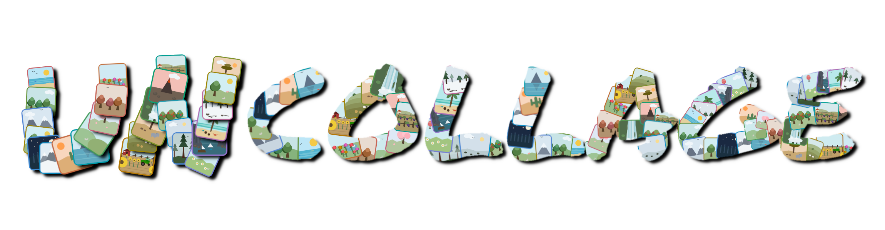

<p align="center">

</p>

# Uncollage

Separates a scanned page or collage into its individual sub-images (photos, postcards, prints).
Detection is based on the uniform scanner/paper background, so sub-images may touch each other and the page edge, and may be slightly rotated (but each is cropped using a rectangle surrounding it so no pixel rotations when saving).

This toolkit has three programs:

| Program | What it does |
|---|---|
| `uncollage.py` | Main tool: automatic splitting + fallback to the pop-up window for difficult collages (see `draw_boxes.py`). |
| `draw_boxes.py` | Simple GUI to draw and edit bounding boxes for sub-images to be cropped from a collage. Can be used standalone. |
| `sam_uncollage.py` | Optional code to allow splitting using Meta's pretrained Segment Anything model. |

## Requirements

- Core: `opencv-python` (cv2) and `numpy`.
- For `sam_uncollage.py` only: `torch`, `torchvision`, `segment-anything`, and the ViT-B checkpoint `sam_vit_b_01ec64.pth` (saved as `sam_vit_b.pth`).

---

## uncollage.py

```
python uncollage.py [options] PATH
```

`PATH` may be:
- an **image file** → its sub-images are extracted;
- a **folder** → every image in it is processed (non-recursive).
  Files that look like sub-images this tool already wrote (e.g. `<original_image>_<n>`) are skipped, so re-running a folder does not re-crop its own outputs;
- a **text file** → each line is an image path (relative paths based on the text file's folder; blank lines and `#` comments are ignored).

Crops are named `<original_image>_1.<ext>`, `<original_image>_2.<ext>`, ... numbered top-to-bottom then left-to-right.

### Options

| Option | Meaning |
|---|---|
| `--out DIR`, `-o DIR` | Write every crop into `DIR` (created if needed), keeping each source's base name. Without it, crops go next to their source image. |
| `--rectangular`, `-r` | Assume sub-images are rectangles and additionally split merged blobs along straight background/shadow seams (guillotine cut). Best for non-rotated photos. |
| `--ai`, `-a` | Like `--rectangular`, but seams come from the small offline net in `seam_ai.py` (needs `seam_model.npz`; train once with `python seam_ai.py train`). |
| `--split-lines`, `-l` | Also split a blob wherever a **full-span straight** content boundary shows it is several butted-together photos with no gap (e.g. touching postcards). A cut must be straight and leave two pieces that each look like a real photo; a piece left too uniform (a sky/sea slice) is discarded, and a cut that would only peel one off is rejected — so a photo's own straight horizon does not split it. **Off by default** (two textured halves of one photo split by a strong straight edge could over-split); enable only on scans you know are composites. |
| `--manual FILE` | Path to the manual-boxes cache (default `manual_boxes.txt`). |
| `--no-draw` | Do not open the box editor for failed pages; just list them in the manual file (for headless/batch use). |

### Manual-boxes fallback (for pages that can't be split automatically)

Some pages can't be split automatically (e.g. faded, borderless photos on
wallpaper with edges difficult to determine). Uncollage handles these
in one run:

1. **Pass 1** processes every input; clean pages are cropped, and any page whose
   automatic split looks merged/failed is queued.
2. **Pass 2** opens the box editor (`draw_boxes.py`) and user draws one box per
   sub-image for each image (sub-images cropped immediately and box coordinates saved after each image so later runs can reuse the values).

With `--no-draw` (or a headless machine with no display), the second pass is skipped and the queued pages are listed in the manual file to be manually drawn later with:

```
python uncollage.py scans/                 # crops what it can, queues the rest
python draw_boxes.py manual_boxes.txt       # draw boxes for the queued pages
python uncollage.py scans/                  # re-run: cached boxes are used
```

### Examples

```
python uncollage.py page.jpg                       # one page, crops beside it
python uncollage.py scans/ -o crops/               # whole folder -> crops/
python uncollage.py scans/ -r -l                    # rectangular + line splitting
python uncollage.py list.txt --no-draw              # batch, no GUI
```

---

## draw_boxes.py

Draw/edit one box per photo. Two modes:

```
python draw_boxes.py IMG [-o boxes.txt] [--run]     # single image -> boxes file
python draw_boxes.py manual_boxes.txt [--redo]      # fill uncollage.py's list
```

- **Single-image mode** writes the boxes to a file (`-o`, default `boxes.txt`).
  With `--run` it then calls `sam_uncollage.py IMG --boxes <file>` to crop.
- **List mode** takes uncollage.py's manual-boxes file: each image lacking boxes
  is opened in turn and the coordinates you draw are written back onto its line
  (`--redo` also redraws lines that already have boxes).

### Controls

| Action | How |
|---|---|
| New box | drag on empty space (or inside another box — boxes may overlap) |
| Resize | drag a corner handle |
| Move | drag a box's edge |
| Options | toolbar buttons **Undo / Clear / Save / Cancel** (hover for a tooltip) |
| Keys | `u` undo · `r` clear · `s`/`Enter` save · `q`/`Esc` cancel |

Because only a box's edge or corner grabs it, a drag starting inside a box makes
a **new** box — so overlapping sub-images can each get their own box.

The window is **resizable** — drag its border to enlarge it and zoom into the
image. When processing a queue (the fallback or list mode) the title shows
progress as `current/total - name.ext`, and the boxes file is rewritten **after
every image**, so a crash never loses work already done.

---

## sam_uncollage.py (optional, pretrained model)

Splits using Meta's Segment Anything (SAM). Useful when the background-based
method merges faded/borderless prints, though it is not a guaranteed click-free
solution.

```
python sam_uncollage.py IMG [--debug]                      # automatic masks
python sam_uncollage.py IMG --boxes boxes.txt [--debug]    # box-prompted (reliable)
```

| Option | Meaning |
|---|---|
| `--boxes FILE` | Refine one rough box per photo (`x y w h` per line) into the exact region; keeps your box where the print edge is invisible. Most reliable mode. |
| `--checkpoint PATH` | Path to the SAM checkpoint (default `./sam_vit_b.pth`). |
| `--debug` | Also write `<stem>.sam_debug.png` with the chosen boxes drawn on. |

---

## seam_ai.py (optional, for `--ai`)

A tiny offline NumPy net that predicts photo-boundary seams, trained on synthetic
collages. Train once, then use `uncollage.py --ai`.

```
python seam_ai.py train [img1 img2 ...]   # (re)train -> seam_model.npz
python seam_ai.py show  IMG               # write IMG.seams.png heat-map
```

---

## Notes & limitations

- Photos that physically overlap, or butt together with **no** separator (no
  gap, border, or tonal edge) and no straight seam, can't be told apart
  automatically — use the manual-boxes fallback.
- `--split-lines` can't distinguish a real print seam from a photo's own strong
  straight internal edge purely by geometry; the uniformity check mitigates this
  (uniform sky/sea slices are dropped), but it stays opt-in.
- Crops keep each sub-image's original orientation (upright bounding box); a
  rotated sub-image therefore keeps small background corners.
